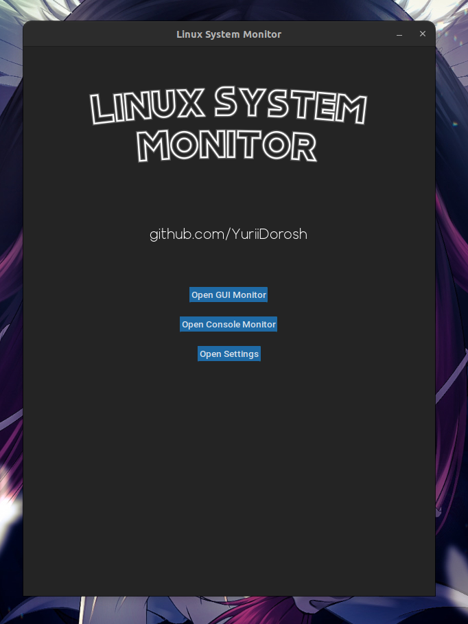

<div align="center">

# Linux System Monitor #

## Video demonstration

[](https://www.youtube.com/watch?v=ggcpF1B6nTQ)

</div>

# Project description

Linux System Monitor is a straightforward program that offers both console and graphical interfaces. Its primary function is to monitor the real-time performance of your PC. (Please note that this is not an exact replica of the Linux system monitor found in every system.)

## Purpose

The main purpose of this program is to assist users in identifying issues and analyzing the load on their computer while running other applications. The availability of both console and graphical interfaces allows users to choose their preferred monitoring method.

## Features
-    Real-time PC Load Monitoring: Keep track of your computer's performance in real time to identify any potential bottlenecks or performance-related problems.

-    Console Interface: A simple text-based interface is provided for users who prefer a lightweight monitoring option.

 -   Graphical Interface: The graphical interface offers a more visually appealing representation of system metrics, allowing users to overlay the program window on top of other applications for convenient monitoring.

  -  Screen Recording: With the graphical interface, users have the option to record their screen, which can be particularly helpful for benchmarking various components of the computer.


## Installation

### Prerequisites

Before using the tool, ensure you have the following dependencies installed:

- `ffmpeg`
- `scrot`
- `git`
- `python3`
- `pip3`

1. Update the package list:

   ```bash
   sudo apt update
   
2. Install ffmpeg:

    ```bash
   sudo apt install ffmpeg
3. Install scrot:

   ```bash
   sudo apt-get install scrot
   
4. Clone this repository:

    ```bash
   git clone https://github.com/YuriiDorosh/Linux-system-monitor.git

5. Set up a virtual environment:

    ```bash
   python3 -m venv env

6. Activate the virtual environment:
    
    ```bash
   source env/bin/activate
   
7. Install required Python packages:

    ```bash
   pip3 install -r requirements.txt
    ```


## Usage 

Navigate to the src/ directory:

   ```bash
   cd src/
   ```

### Greeting window



```bash
   python3 main.py 
   ```

### GUI Version


Run the following command to launch the GUI version:

```bash
   python3 main.py -g
   ```

Alternatively, you can use the long version:
    
```bash
python3 main.py --gui
```    

### Console version


Run the following command to launch the console version:


```bash
   python3 main.py -c
   ```

Alternatively, you can use the long version:
    
```bash
python3 main.py --console
```    


